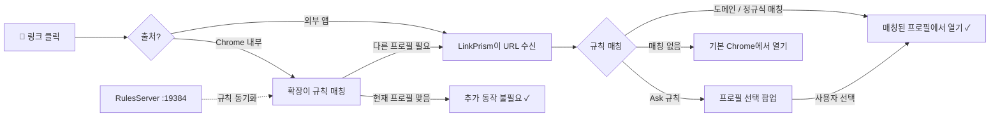

<div align="center">
  
  <h1>LinkPrism</h1>
  <p><strong>Chrome 프로필 사이에서 헤매지 마세요.<br>링크가 알아서 제자리를 찾아갑니다.</strong></p>

  <a href="https://github.com/badaverse/linkprism/releases/latest"></a>
  
  
  <a href="LICENSE"></a>
</div>

<p align="center">
  <a href="README.md">🇺🇸 English</a>
</p>

<br>

매번 잘못된 Chrome 프로필에서 URL이 열리는 불편함, 이제 끝. 도메인 규칙을 한 번만 설정하면 — `notion.so`는 회사, `github.com`은 개인 — 클릭하는 모든 링크가 알아서 제 자리를 찾아갑니다. Chrome 확장과 함께라면 브라우저 안에서 클릭한 링크까지 놓치지 않습니다. 복사-붙여넣기 없이, 클릭 한 번이면 됩니다.

<!-- Screenshots coming soon
<div align="center">
  
  <br><br>
  
</div>
-->

## 설치

### 다운로드

[**GitHub Releases**](https://github.com/badaverse/linkprism/releases/latest)에서 최신 `.dmg`를 다운로드하세요.

1. `.dmg`를 열고 **LinkPrism**을 Applications 폴더에 드래그
2. LinkPrism 실행 — 온보딩 마법사가 설정을 안내합니다
3. **시스템 설정 → 데스크탑 및 Dock → 기본 웹 브라우저**에서 LinkPrism을 선택

> **참고:** 처음 실행 시 macOS 보안 경고가 나타날 수 있습니다. 앱을 우클릭하고 **열기**를 선택하면 Gatekeeper를 우회할 수 있습니다.

### Chrome 확장 프로그램 (권장)

macOS 기본 브라우저 핸들러는 Chrome *내부*에서 클릭한 링크를 가로챌 수 없습니다. 확장 프로그램이 이 문제를 해결합니다.

**Option A — GitHub Release (권장):**
1. [GitHub Releases](https://github.com/badaverse/linkprism/releases/latest)에서 `LinkPrismExtension.zip` 다운로드
2. 압축 해제
3. Chrome에서 `chrome://extensions/` 열기
4. **개발자 모드** 활성화 (우측 상단 토글)
5. **압축해제된 확장 프로그램을 로드합니다** → 압축 해제한 폴더 선택

**Option B — 소스에서:**
1. 이 저장소를 클론 또는 다운로드
2. Chrome에서 `chrome://extensions/` 열기
3. **개발자 모드** 활성화 (우측 상단 토글)
4. **압축해제된 확장 프로그램을 로드합니다** → `LinkPrismExtension/` 폴더 선택

### 소스에서 빌드

```bash
git clone https://github.com/badaverse/linkprism.git
cd linkprism
open LinkPrism/LinkPrism.xcodeproj
```

**Xcode 15+**로 빌드 및 실행 (macOS 14 Sonoma 이상 필요).

## 빠른 시작

1. **실행** — LinkPrism을 열면 온보딩 마법사가 기본 설정을 안내합니다
2. **기본 브라우저 설정** — 시스템 설정 → 데스크탑 및 Dock → 기본 웹 브라우저 → **LinkPrism**
3. **첫 규칙 추가** — 메뉴바 아이콘 → 설정 → **+** 버튼
   - 패턴: `notion.so` · 프로필: `Work` · 타입: Host
4. **테스트** — Notion 링크를 클릭하면 Work 프로필에서 열리는지 확인

> **팁:** 여러 프로필에서 사용하는 도메인(예: `github.com`)에는 **Ask** 모드를 사용하세요. 매번 프로필 선택 팝업이 표시되며, "이 URL은 다시 묻지 않기"를 체크하면 선택을 기억합니다.

## 새로운 기능

- **규칙 동기화 서버** — 로컬 HTTP 서버가 Chrome 확장에 규칙을 실시간 동기화
- **프로필 자동 감지** — 확장이 `chrome.identity`를 통해 현재 Chrome 프로필을 자동 감지
- **스마트 라우팅** — 확장이 클라이언트 측에서 규칙을 매칭하고, 현재 프로필이 맞지 않을 때만 재라우팅
- **URL 기억하기** — "이 URL은 다음부터 묻지 않기"로 URL별 프로필 선택을 저장
- **설정 리디자인** — 메뉴바 + 설정 윈도우 분리, 사이드바 네비게이션
- **기억된 URL 패널** — 규칙별로 저장된 URL-프로필 연결을 관리
- **다국어 지원** — 영어 + 한국어
- **자동 업데이트** — 메뉴바에서 새 버전 확인
- **온보딩 마법사** — 3단계 가이드로 1분 안에 설정 완료
- **도움말 가이드** — 앱 내 패턴 매칭 및 확장 설정 문서
- **리브랜딩** — ProfileRouter에서 LinkPrism으로 이름 변경

## 작동 방식



| 구성 요소 | 역할 |
|-----------|------|
| **LinkPrism.app** | macOS 메뉴바 앱. 기본 브라우저로서 `http`/`https` URL을 가로채고 규칙에 따라 올바른 Chrome 프로필로 라우팅합니다. |
| **Chrome 확장** | Chrome *내부*에서 클릭한 링크를 가로챕니다 (OS 수준 핸들러가 처리할 수 없는 영역). 로컬 HTTP 서버를 통해 앱과 규칙을 동기화하고, 클라이언트 측 규칙 매칭 및 현재 Chrome 프로필 자동 감지를 수행합니다. |
| **로컬 규칙 서버** | `127.0.0.1:19384`에서 실행되는 경량 HTTP 서버. 규칙과 프로필 데이터를 Chrome 확장에 제공합니다. |

## 기능

- **도메인 & 정규식 규칙** — 정확한 호스트(`notion.so`), 와일드카드(`*.atlassian.net`), 정규식(`github\.com/my-org/.*`)으로 라우팅
- **Chrome 프로필 자동 감지** — Chrome의 `Local State`를 읽어 모든 프로필을 자동으로 발견
- **"매번 물어보기" 모드** — 어떤 프로필을 사용할지 모를 때 프로필 선택 팝업 표시
- **URL 선택 기억** — "이 URL은 다시 묻지 않기"를 체크하면 LinkPrism이 선택을 기억
- **메뉴바 상주** — 메뉴바에 조용히 머물며, Dock에는 표시되지 않음
- **규칙 관리** — 라우팅 규칙 추가, 편집, 삭제, 토글, 드래그 정렬
- **가이드 온보딩** — 3단계 설정 마법사로 1분 안에 실행
- **자동 업데이트** — GitHub Releases를 확인하여 업데이트를 놓치지 않음
- **다국어 지원** — 영어, 한국어 (추가 언어 환영!)
- **Chrome 확장** — 브라우저 내 링크 클릭 감지, 앱과 규칙 동기화, 현재 프로필 자동 감지
- **가져오기 / 내보내기** — 라우팅 규칙을 JSON으로 백업 및 복원

## 기술 스택

| 구성 요소 | 기술 |
|-----------|-----------|
| macOS 앱 | Swift, SwiftUI, AppKit |
| Chrome 확장 | JavaScript, Manifest V3, Chrome Identity API |
| 규칙 동기화 | 로컬 HTTP 서버 (`127.0.0.1:19384`) |
| 빌드 | Xcode 15+ |
| 설정 파일 | `~/Library/Application Support/LinkPrism/rules.json` |
| 자동 업데이트 | GitHub Releases API |

## 프로젝트 구조

```
LinkPrism/
├── LinkPrism/                  # macOS SwiftUI 앱
│   ├── App/                       #   LinkPrismApp, AppDelegate, URL 처리
│   ├── Models/                    #   Rule, RememberedRoute
│   ├── Services/                  #   Router, URLRouter, ChromeProfileScanner,
│   │                              #   ConfigManager, RulesServer,
│   │                              #   RememberedRouteManager, UpdateChecker
│   └── Views/                     #   Settings, ProfilePicker, Onboarding,
│                                  #   MenuBarContent, Help, About,
│                                  #   RememberedURLs, RuleEditor, Debug
├── LinkPrismExtension/         # Chrome 확장 (Manifest V3)
│   ├── background.js              #   로컬 서버 규칙 동기화, 프로필 감지
│   ├── content.js                 #   링크 가로채기 + 클라이언트 측 규칙 매칭
│   ├── popup.html/js              #   연결 상태, 프로필 선택, 규칙 동기화
│   ├── icons/                     #   확장 아이콘 (16, 48, 128)
│   └── _locales/                  #   다국어 (en, ko)
└── assets/                        # README 이미지
```

## 기여하기

버그 리포트, 기능 제안, 풀 리퀘스트 등 모든 기여를 환영합니다!

1. 저장소 포크
2. 기능 브랜치 생성 (`git checkout -b feature/amazing-feature`)
3. 변경사항 커밋 (`git commit -m 'Add amazing feature'`)
4. 브랜치에 푸시 (`git push origin feature/amazing-feature`)
5. Pull Request 생성

### 번역

LinkPrism은 Xcode 문자열 카탈로그를 통해 다국어를 지원합니다. 새 언어를 추가하려면:

1. Xcode에서 `LinkPrism/LinkPrism/Localizable.xcstrings` 열기
2. 언어를 추가하고 번역 제공
3. Chrome 확장의 경우 `LinkPrismExtension/_locales/` 아래에 로케일 폴더 추가

알려진 이슈와 기능 요청은 [Issues 페이지](https://github.com/badaverse/linkprism/issues)를 참고하세요.

## 라이선스

이 프로젝트는 MIT 라이선스 하에 배포됩니다 — 자세한 내용은 [LICENSE](LICENSE) 파일을 참고하세요.

<p align="center">
  <a href="README.md">🇺🇸 English</a>
</p>
