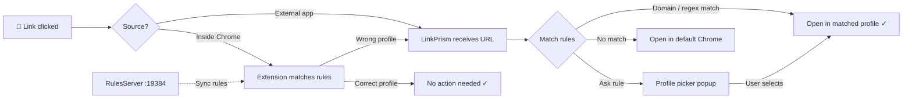

<div align="center">
  
  <h1>LinkPrism</h1>
  <p><strong>Stop juggling Chrome profiles.<br>Let your links find their way home.</strong></p>

  <a href="https://github.com/badaverse/linkprism/releases/latest"></a>
  
  
  <a href="LICENSE"></a>
</div>

<p align="center">
  <a href="README.ko.md">🇰🇷 한국어</a>
</p>

<br>

A macOS menu bar app that puts an end to the daily annoyance of opening URLs in the wrong Chrome profile. Set up domain rules once — `notion.so` goes to Work, `github.com` goes to Personal — and every link you click just opens in the right place. Paired with a Chrome extension that catches even in-browser clicks, LinkPrism routes them seamlessly. No more copy-paste gymnastics. Just click and go.

<!-- Screenshots coming soon
<div align="center">
  
  <br><br>
  
</div>
-->

## Installation

### Download

Download the latest `.dmg` from [**GitHub Releases**](https://github.com/badaverse/linkprism/releases/latest).

1. Open the `.dmg` and drag **LinkPrism** to your Applications folder
2. Launch LinkPrism — the onboarding wizard will guide you through setup
3. Set LinkPrism as your default browser in **System Settings → Desktop & Dock → Default web browser**

> **Note:** On first launch, macOS may show a security prompt. Right-click the app and choose **Open** to bypass Gatekeeper.

### Build from Source

```bash
git clone https://github.com/badaverse/linkprism.git
cd linkprism
open LinkPrism/LinkPrism.xcodeproj
```

Build and run with **Xcode 15+** (requires macOS 14 Sonoma or later).

### Chrome Extension (Recommended)

The macOS default browser handler can't intercept links clicked *within* Chrome. The extension solves this.

**Option A — GitHub Release (recommended):**
1. Download `LinkPrism-Extension-{version}.zip` from [GitHub Releases](https://github.com/badaverse/linkprism/releases/latest)
2. Unzip the file
3. Open `chrome://extensions/` in Chrome
4. Enable **Developer mode** (toggle in top-right)
5. Click **Load unpacked** → select the unzipped folder

**Option B — From source:**
1. Clone or download this repository
2. Open `chrome://extensions/` in Chrome
3. Enable **Developer mode** (toggle in top-right)
4. Click **Load unpacked** → select the `LinkPrismExtension/` folder

## Quick Start

1. **Launch** — Open LinkPrism. The onboarding wizard walks you through the basics.
2. **Set as default browser** — System Settings → Desktop & Dock → Default web browser → **LinkPrism**
3. **Add your first rule** — Click the menu bar icon → Settings → **+** button
   - Pattern: `notion.so` · Profile: `Work` · Type: Host
4. **Test it** — Click any Notion link and watch it open in your Work profile

> **Tip:** Use **Ask** mode for domains you use across multiple profiles (like `github.com`). LinkPrism will pop up a profile picker each time — and you can check "Don't ask again" to remember your choice for that specific URL.

## What's New

- **Rule sync server** — Local HTTP server syncs rules to the Chrome extension in real time
- **Auto profile detection** — Extension auto-detects the current Chrome profile via `chrome.identity`
- **Smart routing** — Extension performs client-side rule matching and only reroutes when the current profile doesn't match
- **URL remembering** — "Don't ask again for this URL" saves your profile choice per URL
- **Settings redesign** — Menu bar + settings window separation with sidebar navigation
- **Remembered URLs panel** — View and manage saved URL-to-profile associations per rule
- **i18n** — English + Korean support
- **Auto-update** — Check for new versions from the menu bar
- **Onboarding wizard** — 3-step guided setup for new users
- **Help guide** — In-app docs for pattern matching and extension setup
- **Rebranding** — Renamed from ProfileRouter to LinkPrism

## How It Works



| Component | Role |
|-----------|------|
| **LinkPrism.app** | macOS menu bar app. Intercepts `http`/`https` URLs as the default browser and routes them to the right Chrome profile based on your rules. |
| **Chrome Extension** | Catches link clicks *inside* Chrome (which the OS-level handler can't intercept). Syncs rules from the app via a local HTTP server, performs client-side rule matching, and auto-detects the current Chrome profile. |
| **Local Rule Server** | Lightweight HTTP server on `127.0.0.1:19384` that serves rules and profile data to the Chrome extension. |

## Features

- **Domain & regex rules** — Route by exact host (`notion.so`), wildcard (`*.atlassian.net`), or full regex (`github\.com/my-org/.*`)
- **Auto-detect Chrome profiles** — Reads Chrome's `Local State` to discover all your profiles automatically
- **"Ask every time" mode** — Show a profile picker popup when you're unsure which profile to use
- **Remember URL choices** — Check "Don't ask again for this URL" and LinkPrism remembers your preference
- **Menu bar resident** — Lives quietly in your menu bar, hidden from the Dock
- **Rule management** — Add, edit, delete, toggle, and drag-to-reorder your routing rules
- **Guided onboarding** — 3-step setup wizard gets you running in under a minute
- **Auto-update** — Checks GitHub Releases so you never miss an update
- **i18n** — English and Korean (more languages welcome!)
- **Chrome extension** — Catches in-browser link clicks, syncs rules from the app, and auto-detects the current profile
- **Import / Export** — Back up and restore your routing rules as JSON

## Tech Stack

| Component | Technology |
|-----------|-----------|
| macOS App | Swift, SwiftUI, AppKit |
| Chrome Extension | JavaScript, Manifest V3, Chrome Identity API |
| Rule Sync | Local HTTP server (`127.0.0.1:19384`) |
| Build | Xcode 15+ |
| Config | `~/Library/Application Support/LinkPrism/rules.json` |
| Auto-Update | GitHub Releases API |

## Project Structure

```
LinkPrism/
├── LinkPrism/                  # macOS SwiftUI app
│   ├── App/                       #   LinkPrismApp, AppDelegate, URL handling
│   ├── Models/                    #   Rule, RememberedRoute
│   ├── Services/                  #   Router, URLRouter, ChromeProfileScanner,
│   │                              #   ConfigManager, RulesServer,
│   │                              #   RememberedRouteManager, UpdateChecker
│   └── Views/                     #   Settings, ProfilePicker, Onboarding,
│                                  #   MenuBarContent, Help, About,
│                                  #   RememberedURLs, RuleEditor, Debug
├── LinkPrismExtension/         # Chrome extension (Manifest V3)
│   ├── background.js              #   Rule sync via local server, profile detection
│   ├── content.js                 #   Link interception + client-side rule matching
│   ├── popup.html/js              #   Connection status, profile selector, rule sync
│   ├── icons/                     #   Extension icons (16, 48, 128)
│   └── _locales/                  #   i18n (en, ko)
└── assets/                        # README images
```

## Contributing

Contributions are welcome! Whether it's bug reports, feature requests, or pull requests — every bit helps.

1. Fork the repository
2. Create a feature branch (`git checkout -b feature/amazing-feature`)
3. Commit your changes (`git commit -m 'Add amazing feature'`)
4. Push to the branch (`git push origin feature/amazing-feature`)
5. Open a Pull Request

### Translation

LinkPrism supports i18n via Xcode string catalogs. To add a new language:

1. Open `LinkPrism/LinkPrism/Localizable.xcstrings` in Xcode
2. Add your language and provide translations
3. For the Chrome extension, add a locale folder under `LinkPrismExtension/_locales/`

See the [open issues](https://github.com/badaverse/linkprism/issues) for known issues and feature requests.

## License

This project is licensed under the MIT License — see the [LICENSE](LICENSE) file for details.

<p align="center">
  <a href="README.ko.md">🇰🇷 한국어</a>
</p>
