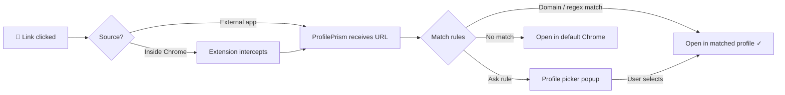

<div align="center">
  
  <h1>ProfilePrism</h1>
  <p><strong>Stop juggling Chrome profiles.<br>Let your links find their way home.</strong></p>

  <a href="https://github.com/badaverse/profileprism/releases/latest"></a>
  
  
  <a href="LICENSE"></a>
</div>

<br>

A macOS menu bar app that puts an end to the daily annoyance of opening URLs in the wrong Chrome profile. Set up domain rules once — `notion.so` goes to Work, `github.com` goes to Personal — and every link you click just opens in the right place. Paired with a Chrome extension that catches even in-browser clicks, ProfilePrism routes them seamlessly. No more copy-paste gymnastics. Just click and go.

<details>
<summary>🇰🇷 한국어</summary>
<br>
매번 잘못된 Chrome 프로필에서 URL이 열리는 불편함, 이제 끝. 도메인 규칙을 한 번만 설정하면 — <code>notion.so</code>는 회사, <code>github.com</code>은 개인 — 클릭하는 모든 링크가 알아서 제 자리를 찾아갑니다. Chrome 확장과 함께라면 브라우저 안에서 클릭한 링크까지 놓치지 않습니다.
</details>

<!-- Screenshots coming soon
<div align="center">
  
  <br><br>
  
</div>
-->

## Installation

### Download

Download the latest `.dmg` from [**GitHub Releases**](https://github.com/badaverse/profileprism/releases/latest).

1. Open the `.dmg` and drag **ProfilePrism** to your Applications folder
2. Launch ProfilePrism — the onboarding wizard will guide you through setup
3. Set ProfilePrism as your default browser in **System Settings → Desktop & Dock → Default web browser**

> **Note:** On first launch, macOS may show a security prompt. Right-click the app and choose **Open** to bypass Gatekeeper.

### Build from Source

```bash
git clone https://github.com/badaverse/profileprism.git
cd profileprism
open ProfilePrism/ProfilePrism.xcodeproj
```

Build and run with **Xcode 15+** (requires macOS 14 Sonoma or later).

### Chrome Extension (Recommended)

The macOS default browser handler can't intercept links clicked *within* Chrome. The extension solves this.

**Option A — GitHub Release (recommended):**
1. Download `ProfilePrism-Extension-{version}.zip` from [GitHub Releases](https://github.com/badaverse/profileprism/releases/latest)
2. Unzip the file
3. Open `chrome://extensions/` in Chrome
4. Enable **Developer mode** (toggle in top-right)
5. Click **Load unpacked** → select the unzipped folder

**Option B — From source:**
1. Clone or download this repository
2. Open `chrome://extensions/` in Chrome
3. Enable **Developer mode** (toggle in top-right)
4. Click **Load unpacked** → select the `ProfilePrismExtension/` folder

<details>
<summary>🇰🇷 설치 가이드 (한국어)</summary>
<br>

**다운로드:** [GitHub Releases](https://github.com/badaverse/profileprism/releases/latest)에서 최신 `.dmg`를 다운로드하세요.

1. `.dmg`를 열고 **ProfilePrism**을 Applications 폴더에 드래그
2. ProfilePrism 실행 — 온보딩 마법사가 설정을 안내합니다
3. **시스템 설정 → 데스크탑 및 Dock → 기본 웹 브라우저**에서 ProfilePrism을 선택

**소스에서 빌드:**
```bash
git clone https://github.com/badaverse/profileprism.git
cd profileprism
open ProfilePrism/ProfilePrism.xcodeproj
```
Xcode 15+, macOS 14 이상 필요.

**Chrome 확장 (Option A — GitHub Release):**
1. [GitHub Releases](https://github.com/badaverse/profileprism/releases/latest)에서 `ProfilePrism-Extension-{version}.zip` 다운로드
2. 압축 해제
3. Chrome에서 `chrome://extensions/` 열기
4. **개발자 모드** 활성화
5. **압축해제된 확장 프로그램을 로드합니다** → 압축 해제한 폴더 선택

**Chrome 확장 (Option B — 소스에서):**
1. 이 저장소를 클론 또는 다운로드
2. Chrome에서 `chrome://extensions/` 열기
3. **개발자 모드** 활성화
4. **압축해제된 확장 프로그램을 로드합니다** → `ProfilePrismExtension/` 폴더 선택
</details>

## Quick Start

1. **Launch** — Open ProfilePrism. The onboarding wizard walks you through the basics.
2. **Set as default browser** — System Settings → Desktop & Dock → Default web browser → **ProfilePrism**
3. **Add your first rule** — Click the menu bar icon → Settings → **+** button
   - Pattern: `notion.so` · Profile: `Work` · Type: Host
4. **Test it** — Click any Notion link and watch it open in your Work profile

> **Tip:** Use **Ask** mode for domains you use across multiple profiles (like `github.com`). ProfilePrism will pop up a profile picker each time — and you can check "Don't ask again" to remember your choice for that specific URL.

<details>
<summary>🇰🇷 빠른 시작 (한국어)</summary>
<br>

1. **실행** — ProfilePrism을 열면 온보딩 마법사가 기본 설정을 안내합니다
2. **기본 브라우저 설정** — 시스템 설정 → 데스크탑 및 Dock → 기본 웹 브라우저 → **ProfilePrism**
3. **첫 규칙 추가** — 메뉴바 아이콘 → 설정 → **+** 버튼
   - 패턴: `notion.so` · 프로필: `Work` · 타입: Host
4. **테스트** — Notion 링크를 클릭하면 Work 프로필에서 열리는지 확인

> **팁:** 여러 프로필에서 사용하는 도메인(예: `github.com`)에는 **Ask** 모드를 사용하세요. 매번 프로필 선택 팝업이 표시되며, "이 URL은 다시 묻지 않기"를 체크하면 선택을 기억합니다.
</details>

## What's New

- **URL remembering** — "Don't ask again for this URL" saves your profile choice per URL
- **Settings redesign** — Menu bar + settings window separation with sidebar navigation
- **Remembered URLs panel** — View and manage saved URL-to-profile associations per rule
- **i18n** — English + Korean support
- **Auto-update** — Check for new versions from the menu bar
- **Onboarding wizard** — 3-step guided setup for new users
- **Help guide** — In-app docs for pattern matching and extension setup
- **Rebranding** — Renamed from ProfileRouter to ProfilePrism

## How It Works



| Component | Role |
|-----------|------|
| **ProfilePrism.app** | macOS menu bar app. Intercepts `http`/`https` URLs as the default browser and routes them to the right Chrome profile based on your rules. |
| **Chrome Extension** | Catches link clicks *inside* Chrome (which the OS-level handler can't intercept) and forwards them to the app via `profileprism://` scheme. |

## Features

- **Domain & regex rules** — Route by exact host (`notion.so`), wildcard (`*.atlassian.net`), or full regex (`github\.com/my-org/.*`)
- **Auto-detect Chrome profiles** — Reads Chrome's `Local State` to discover all your profiles automatically
- **"Ask every time" mode** — Show a profile picker popup when you're unsure which profile to use
- **Remember URL choices** — Check "Don't ask again for this URL" and ProfilePrism remembers your preference
- **Menu bar resident** — Lives quietly in your menu bar, hidden from the Dock
- **Rule management** — Add, edit, delete, toggle, and drag-to-reorder your routing rules
- **Guided onboarding** — 3-step setup wizard gets you running in under a minute
- **Auto-update** — Checks GitHub Releases so you never miss an update
- **i18n** — English and Korean (more languages welcome!)
- **Chrome extension** — Catches in-browser link clicks that the OS-level handler can't reach

## Tech Stack

| Component | Technology |
|-----------|-----------|
| macOS App | Swift, SwiftUI, AppKit |
| Chrome Extension | JavaScript, Manifest V3 |
| Build | Xcode 15+ |
| Config | `~/Library/Application Support/ProfilePrism/rules.json` |
| Auto-Update | GitHub Releases API |

## Project Structure

```
ProfilePrism/
├── ProfilePrism/                  # macOS SwiftUI app
│   ├── App/                       #   Entry point, AppDelegate, URL handling
│   ├── Models/                    #   Rule, RememberedRoute, ConfigManager
│   ├── Services/                  #   Router, URLRouter, ChromeProfileScanner,
│   │                              #   RememberedRouteManager, UpdateChecker
│   └── Views/                     #   Settings, ProfilePicker, Onboarding,
│                                  #   MenuBarContent, Help, About
├── ProfilePrismExtension/         # Chrome extension (Manifest V3)
│   ├── content.js                 #   Link click detection
│   ├── background.js              #   Forward to profileprism:// scheme
│   ├── popup.html/js              #   App info & download links
│   └── _locales/                  #   i18n (en, ko)
└── assets/                        # README images
```

## Contributing

Contributions are welcome! Whether it's bug reports, feature requests, or pull requests — every bit helps.

1. Fork the repository
2. Create a feature branch (`git checkout -b feature/amazing-feature`)
3. Commit your changes (`git commit -m 'Add amazing feature'`)
4. Push to the branch (`git push origin feature/amazing-feature`)
5. Open a Pull Request

### Translation

ProfilePrism supports i18n via Xcode string catalogs. To add a new language:

1. Open `ProfilePrism/ProfilePrism/Localizable.xcstrings` in Xcode
2. Add your language and provide translations
3. For the Chrome extension, add a locale folder under `ProfilePrismExtension/_locales/`

See the [open issues](https://github.com/badaverse/profileprism/issues) for known issues and feature requests.

## License

This project is licensed under the MIT License — see the [LICENSE](LICENSE) file for details.
